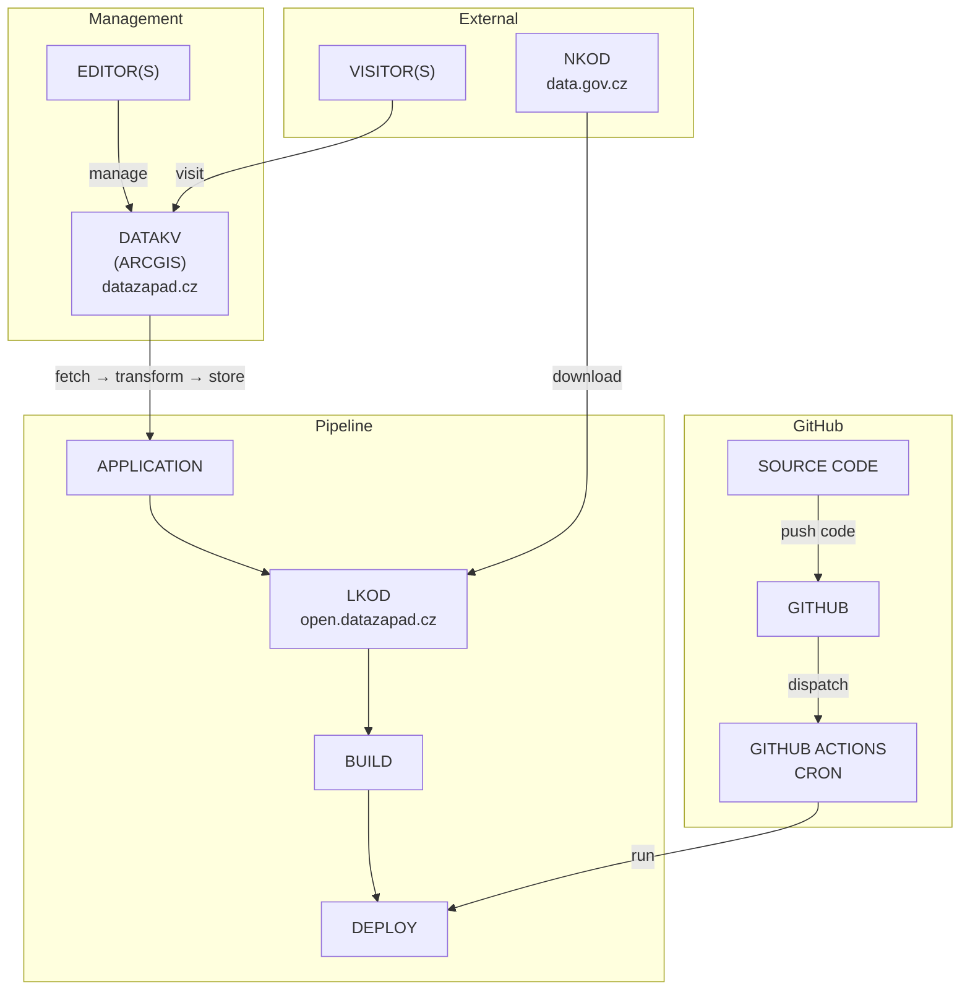

# Opendata Karlovarského kraje

- Web: https://datazapad.cz
- Katalog: https://open.datazapad.cz/katalog.jsonld
- NKOD: https://data.gov.cz/datov%C3%A9-sady
- NKOD (KV): https://data.gov.cz/datov%C3%A9-sady?poskytovatel=https%3A%2F%2Frpp-opendata.egon.gov.cz%2Fodrpp%2Fzdroj%2Forg%C3%A1n-ve%C5%99ejn%C3%A9-moci%2F70889546

## Overview

## Development

**Tech stack**

- Node.js
- JavaScript
- TypeScript
- ECMAScript (https://github.com/standard-things/esm)

**Workflow**

- Source code on Github (https://github.com)
- Deployments on Vercel (https://vercel.com)

**Guidelines**

- Install dependencies via `make install`
- Build LKOD via `make build`
  - Download data from ArcGIS Hub via `make sync`
  - Transfer ArcGIS Hub data to NKOD data via `make transform`
  - Create LKOD via `make generata`

## Configuration

There is a file called `config.ts` in root of this project. Take a look and edit whatever you want.

## Documentation

## Index

- NKOD = `Národní katalog otevřených dat`
- LKOD = `Lokální katalog otevřených dat`
- KV = `Karlovarský kraj`

## Credits

This package is currently maintained by these authors.

